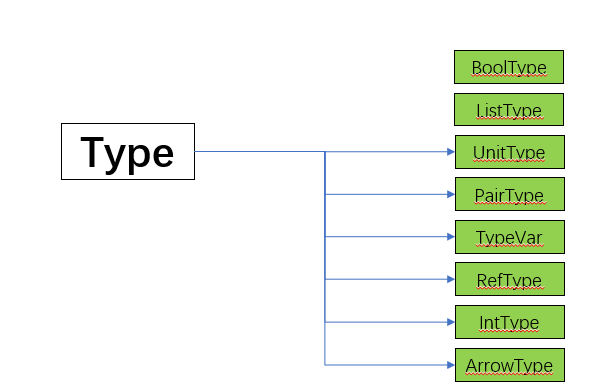

# SimPL-Interpreter

Ziteng Yang


## 1. Overview

This is the implementation document of an interpreter for the programming language SimPL (pronounced simple),  which is a simplified dialect of ML and can be used for both functional and imperative programming.

See [project.pdf](./project.pdf) for the specification of this language and the original goals.

The project has been uploaded to https://github.com/Youngzt998/SimPL-Interpreter


## 2. Project Architecture

### 2.1. Files Structure

#### 2.1.1. Source code

The entry of the main Java class was in `src/simpl/interpreter/Interpreter.java`. Besides, other code files are listed:

- `src/simpl/parser/`: the parser generator and parser used in this project for SimPL

  - `./ast/*.java`: Classes representing the abstract syntax tree for SimPL

- `src/simpl/interpreter/`

  - `./*Value.java` : The value class and all its subclass, used for evaluation steps

  - `./lib` and `../pcf`: Several predefined functions
  - `State.java`, `Env.java`, ... : Classes representing the environment of a SimPL program evaluation

- `src/simpl/typing`/*.java: Classes representing the types of SimPL


#### 2.2.2. Other Files

- `Readme.md` : this file
- `project.pdf`: a specification of SimPL, i.e. the original goal of this project
- `structure.pptx`: a graphic structure showing the sub-tying relations among all Java classes


### 2.2. Test the Interpreter

A packaged .jar file was uploaded to the examples file, i.e.  `./examples/SimPL.jar`. There are also some   SimPL program. See `factorial.spl`  as an example:

```
let fact = rec f => fn x => if x=1 then 1 else x * (f (x-1))
in  fact 4
end
(* ==> 24 *)
```


To test the interpreter, open the terminal in this file and run the following code in command line (Java environment was required):

```shell
java -jar ./SimPL.jar ./factorial.spl
```

If every thing goes right, we will get the output:

```
int
24
```


## 3. Implementation Details

### 3.1. Principle Data Structures

#### 3.1.1. Symbols and Expressions

Any valid program of SimPL would be parsed into a Java abstract class `Expr`  [defined in `src/simpl/parser/ast/Expr.java`], which has several subtype, defined as follows:

```Java
public abstract class Expr {

    public abstract Expr replace(Symbol x, Expr e);
    public abstract TypeResult typecheck(TypeEnv E) throws TypeError;
    public abstract Value eval(State s) throws RuntimeError;
}
```

Three member function are declared:

- `replace`: Replace a variable `x` in `this` expression with another express `e`
- `typecheck`: Check the type of `this` expression and throw `TypeError` if it has type error.
- `eval`: Evaluate the expression following the operational semantics in the Specification 

A `Symbol x` can be considered as a variable expression, but it should be encapsulated in `Name(x)` as an expression.

The next figure suggest the sub-typing structures of all expressions:


### 3.2. Abstract Syntax Tree (AST)

#### 3.2.1. Arithmetic and Boolean Expressions

We use `Add` (arithmetic) and `Not` (boolean) expression as examples.

-  `Add` expression was inherited from `ArithExpr` expression that implements several  common features of arithmetic expressions.  Again `ArithExpr` was inherited from binary expression `BinaryExpr`.

  In Java, it can be implemented as the following (`eval` method was left in evaluation part):

  ```java
  public abstract class BinaryExpr extends Expr {
  
      public Expr l, r;
      public BinaryExpr(Expr l, Expr r) {
          this.l = l;
          this.r = r;
      }
  }
  ```

  which states that a binary expression consists of two expressions, and

  ```Java
  public abstract class ArithExpr extends BinaryExpr {
  
      public ArithExpr(Expr l, Expr r) {
          super(l, r);
      }
      
      @Override
      public TypeResult typecheck(TypeEnv E) throws TypeError {
      	...
      }
  }
  ```

  that defines the same typing rule of all arithmetic expressions, and

  ```java
  public class Add extends ArithExpr {
  
      public Add(Expr l, Expr r) {
          super(l, r);
      }
  
      public String toString() {
          return "(" + l + " + " + r + ")";
      }
  
      @Override
      public Add replace(Symbol x, Expr e) {
          return new Add(l.replace(x, e), r.replace(x, e));
      }
  
      @Override
      public Value eval(State s) throws RuntimeError {
  		...
      }
  }
  ```

  that defines the specific evaluation rules of `Add`.

  The `replace` method was defined recursively.


- `Not` expression is similar to `Add` , but it was inherited from `UnaryExpr`:

  ```java
  public class Not extends UnaryExpr {
  
      public Not(Expr e) {
          super(e);
      }
  
      public String toString() {
          return "(not " + e + ")";
      }
  
      public Not replace(Symbol x, Expr e) {
          return new Not(this.e.replace(x, e));
      }
  
  
      @Override
      public TypeResult typecheck(TypeEnv E) throws TypeError {
  		...
      }
  
      @Override
      public Value eval(State s) throws RuntimeError {
  		...
      }
  }
  ```

   


#### 3.2.2. Lambda Calculus and Functional Application

- The Lambda calculus in SimPL was denoted by `fn x => e` 

  In Java implementation, it consist of a `Symbol x`  and an `Expr e`:

  ```java
  public class Fn extends Expr {
  
      public Symbol x;
      public Expr e;
   
      /* specific method for Fn */
      ...
  }
  ```

  Note that the `replace` interface should compare `this.x` with `x`:

  ```java
  @Override
  public Fn replace(Symbol x, Expr e) {
      if(this.x.toString().equals(x.toString())){
          return this;
      }
      else return new Fn(this.x, this.e.replace(x, e));
  }
  ```

  

- The functional application $e_1\ e_2$ was just a binary expression.


#### 3.2.3. Let Expressions

The `Let` expression $let\ x = e_1\ in\ e_2$ also has a `Symbol` member representing the variable `x`

```java
public class Let extends Expr {

    public Symbol x;
    public Expr e1, e2;
    /* specific method for Let */
    ...
}
```


#### 3.2.4. List, Pair and Other Structures 

The SimPL language also has some structures such as list and pair. The list was named `Cons` and the pair was `Pair`. The Java class of them are similar to the previous ones.


#### 3.2.5. Imperative Features

SimPL also has imperative features such as while-loop, assignment and (virtual) memory location.

- `Loop` was the while-loop $while\ e_1\ do\ e_2$ of SimPL.
- `Ref` represents a unary operation $ref\ e$ denoting a memory reference to $e$ ; correspondingly, `Deref` represents a unary  operation $!e$ that aim to get the value from the memory reference.
- `Assign` represent an assignment $e_1\ :=\ e_2$ that change the value of the memory referred by $e_1$

All the Java classes' structure of the above expressions are similar to the previous ones, varying in their members as well as the `replace`, `typecheck` and `eval` method. 


### 3.3. Type Checking with Polymorphism

[ **Note:** Although for the interpreter, type checking runs first, it might give a better understanding about the code  to see evaluation step first. ]

Before running the program, we should do a type checking first to avoid some runtime error.


#### 3.3.1. The Class Type

An abstract class `Type` was defined representing the data type of SimPL:

```java
public abstract class Type {

    public abstract boolean isEqualityType();
    public abstract Type replace(TypeVar a, Type t);
    public abstract boolean contains(TypeVar tv);
    public abstract Substitution unify(Type t) throws TypeError;

    public static final Type INT = new IntType();
    public static final Type BOOL = new BoolType();
    public static final Type UNIT = new UnitType();
}
```

- `isEqualityType` decide whether `this` type was comparable (such as $e_1 = e_2$)
- `replace` change all occurrence of a  type variable `a` in `this` type to ` some type `t` 
- `contains` checks whether `this` type contains the type variable `tv`
- `unify` gives a `Substitutino` structure stating that `this` type is equal to the type `t`, which would be used in the unification process


The following figure shows the sub-type relation of `Type`





#### 3.3.2. The Class Substitution and Unification Algorithm

The `Substitucion` was a data structure that implements the unification algorithm in type inference.

It has a method `apply`, that transform one type to another type, i.e. $S(a) = t$ in unification process.

```java
public abstract class Substitution {
    public abstract Type apply(Type t);
    /* Some methods and subtypes */
    ...
}
```

It has three subtype

- `Identity`: the identity function, which means "do nothing": give the `t`, return the `t`

  ```java
  private static final class Identity extends Substitution {
      public Type apply(Type t) {
          return t;
      }
  
      public String toString(){
          return "Id";
      }
  }
  ```

  

- `Replace`: the single substitution $[a=t]$ 

  ```java
  private static final class Replace extends Substitution {
      private TypeVar a;
      private Type t;
  
      public Type apply(Type b) {
          return b.replace(a, t);
      }
  
      public String toString(){
          return a + " = " + t;
      }
  }
  ```

  

- `Compose`: the composition of two substitution $T * S(a)= T(S(a)) $

  ```java
  private static final class Compose extends Substitution {
      private Substitution f, g;
  
  	...
      public Type apply(Type t) {
          /**
          *  The sequence is principle
          */
          return g.apply(f.apply(t));
      }
  	...
  }
  ```

  

#### 3.3.2. Type Checking and Inference

The SimPL uses implicit type, and also has polymorphic types. Type inference was achieved, including Let-Polymorphism. Following cases of type checking for normal expressions and let expressions was used to suggest how to implement type inference by unification.

##### Arithmetic Expressions

The interface `typecheck`  generates the implementation:

```java
Expr l, r;
...
@Override
public TypeResult typecheck(TypeEnv E) throws TypeError {
	...    
}
```

Now we have expression `l` and `r`,, and current type environment `E`. We want to check whether `l + r` was a valid expression. The first thing is to check `l` under `E`:

```java
TypeResult tr1 = l.typecheck(E);
```

A `TypeResult` consists of a `Substitution s` and a `Type t`. An principle issue is that, this might give new type environment, so we must check `r` in the new environment:

```java
TypeEnv NewE = tr1.s.compose(E);
TypeResult tr2 = r.typecheck(NewE);
```

Now we have two result and two substitution. According to the constraint typing rule

```java
/*
*  Compose two substitution to get a new substitution
*      then compose two substitution that {tr1.t = Int} and {tr2.t = Int}
*
*      G |- e1: t1, q1    G |- e2:t2, q2    bop \in {+, -, *, /}
*      ------------------------------------------------------------
*      G |- e1 bop e2: int, q1 U q2 U {t1 = int} U {t2 = int}
*/
```

we should give a new substitution composed by 

- the ones from `l`, `r` and 
- the hint `l` and `r` 's type should be `INT`

```java
Substitution comp = tr1.s.compose(tr2.s);
Substitution s1 = comp.apply(tr1.t).unify(Type.INT);
comp = comp.compose(s1);
Substitution s2 = comp.apply(tr2.t).unify(Type.INT);
comp = comp.compose(s2);

return TypeResult.of(comp, Type.INT);
```


***A crucial issue*** here is that `comp.apply(tr1.t)` would transform the last type result `tr1.t` to a more specific type $S(tr1.s)$ . This indeed realize the unification algorithm, without specially run it seperately.


##### Functional Application

For the function $fn.x => e_1$, it introduces a new variable x, but we do not know the type of it. So we create a new `TypeVar` variable to join the type inference.

```java
TypeVar a = new TypeVar(true);
```

But we can still check the type of $e$, additionally with the assumption $[x: a]$ added to current environment. 

```java
TypeResult tr = e.typecheck(TypeEnv.of(E, x, a));
```

We should know the type of `this` expression is some `ArrowType`, so we return a new `ArrowType` with the substitution, yet we might not get the full information of $e$ 's type.

```java
ArrowType arrow = new ArrowType(tr.s.apply(a), tr.s.apply(tr.t));
return TypeResult.of(tr.s, arrow);
```


##### Name

`Name` is an expression corresponding to the single variable expression. To check the type of a variable, we could do nothing more but refer to current type environment. If current variable was not bound to any type, then we found a type error.

```java
@Override
public TypeResult typecheck(TypeEnv E) throws TypeError {
    // TODO
    if (E.get(x) == null)
        throw new TypeError("type error: symbol " + x + "not found");

    return TypeResult.of(E.get(x));
}
```


##### Let and Let-Polymorphysm

Most of the implementation are similar to the ones above by following the constraint typing rules, except `Let` since we wish to realize Let-Polymorphism by rule

```java
/**
*  Rule CT-LETPOLY:
*      G |- e2[e1/x]: t2, q   G|- e1: t1
*      ---------------------------------
*      G |- let x = e1 in e2 end: t2, q
*/
```

which suggests us to replace `x` with `e1` in `e2` first and then do type checking instead of check `e1` directly.

We still should run the typecheck

```
e1.typecheck(E);
```

because we do not wish  $let\ x\ =\ <type\ error\ expr>\ in\ 1$  to pass the checking.

Then we can do the replacement and give the result:

```java
TypeResult tr = e2.replace(x, e1).typecheck(E);
return TypeResult.of(tr.s, tr.s.apply(tr.t));
```


### 3.4. Evaluation

After type checking, the program should run normally and it's time to evaluate the it.


#### 3.4.1. The Class Value

We use the class `Value` to represent the final value

```java
public abstract class Value {
    public static final Value NIL = new NilValue();
    public static final Value UNIT = new UnitValue();

    public abstract boolean equals(Object other);
}
```

The member of `Value` was very simple with a method `equals` to check the equality.

The following figure shows the sub-type relation of `Value`


#### 3.4.2 Evaluate the Expression

The implementation of evaluation was shown by the following representative examples.

##### Arithmetic Expression

Again the `Add` was used as an example, now we implement the `eval` interface in `Add` to realize this evaluation step under $e_1 + e_2$

```java
@Override
public Value eval(State s) throws RuntimeError {
    // TODO
    /*
            Check Type ?
            Or type already checked here?
        */
    return new IntValue(((IntValue)l.eval(s)).n + ((IntValue)r.eval(s)).n);
}
```

The evaluation was taken recursively (using ***Big-step Semantics***) : just evaluate the left and the right, then add them together.


##### Functional Application

In Lambda Calculus, the function $fn\ x=>e$ was just a value. So we just give a `FunValue` for the evaluation of `Fn`

```java
public Symbol x;
public Expr e;
...
public Value eval(State s) throws RuntimeError {
    // TODO
    /**
         *  Just evaluate to a FunValue
         */
    return new FunValue(s.E, x, e);
}
```

Then we can implement the application $e_1\ e_2$ method `App` .

Firstly we know `l` must evaluate to a `FunValue` since it past the type check, then we evaluate `r` to a `Value v2`. Now the expression in the `FunValue` should replace its `x` with `Value v2`

```java
public Expr l, r;
@Override
public Value eval(State s) throws RuntimeError {
    FunValue v1 = (FunValue) l.eval(s);
    Value v2 = r.eval(s);
    return v1.e.eval(State.of(new Env(v1.E, v1.x, v2), s.M, s.p));

}
```


##### Let Expression

The `Let` expression's evaluation step was very simple: evaluate the `e1`  to `v1`, then replace `x` in `e2` by `v1`, while we do not replace it directly but update current environment instead to save computation and avoid renaming issues. 

```java
Value v1 = e1.eval(s);
return e2.eval(State.of(new Env(s.E, x, v1), s.M, s.p));
```


##### Imperative Expressions

If a `Ref` expression was evaluate, then a new memory unit was created, so the memory pointer should increase. After evaluation, the value of this expression should be stored in memory.

```java
public Expr e;
...
@Override
public Value eval(State s) throws RuntimeError {
    int i = s.p.get();
    s.p.set(i + 1);
    Value v = e.eval(s);
    s.M.put(i + 1, v);
    return new RefValue(i + 1);
}
```

And if we want to get the memory content by `Deref`, we just get the memory pointer of `v` evaluated from `e` and search the (virtual) memory unit.

```java
public Expr e;
...
@Override
public Value eval(State s) throws RuntimeError {
    // TODO
    /**
         *  e -> v where v = (ref vp)
         *  !e -> M(vp) where s = (E, M, p)
         */
    RefValue v = (RefValue) e.eval(s);
    return s.M.get(v.p);
}
```


### 3.5.  Built-in Funtion

See `fst` as an example: it was a `FunValue`, and has a symble `fst` , and a special expression that return the first element of a variable named `fst` in current environment.

```java
public class fst extends FunValue {

    public fst() {
        super(Env.empty, Symbol.symbol("fst"), getExpr());
    }

    private static Expr getExpr(){
        Expr e = new Expr() {
            @Override
            public Expr replace(Symbol x, Expr e) {
                return this;
            }

            @Override
            public TypeResult typecheck(TypeEnv E) throws TypeError {
                return TypeResult.of(new TypeVar(true));
            }

            @Override
            public Value eval(State s) throws RuntimeError {
                PairValue v =(PairValue) s.E.get(Symbol.symbol("fst"));
                return v.v1;
            }
        };
        return e;
    }

}
```

